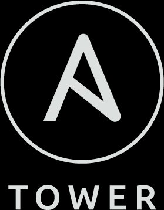
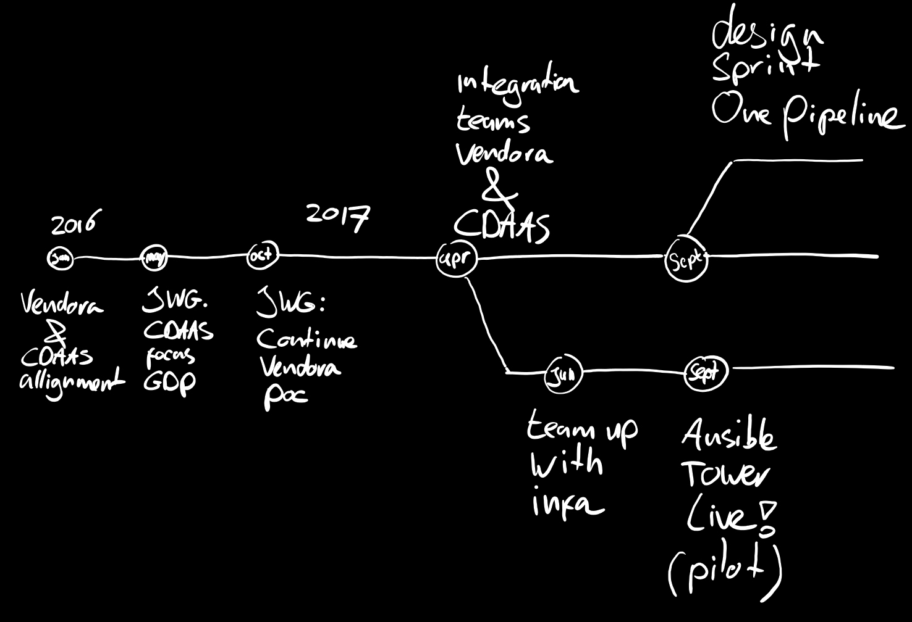
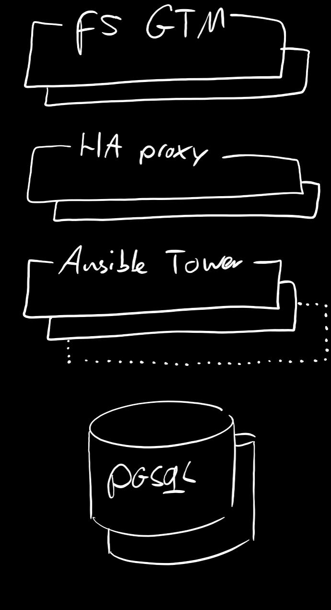
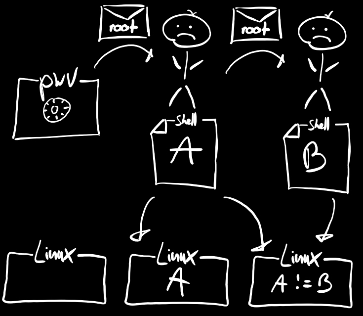
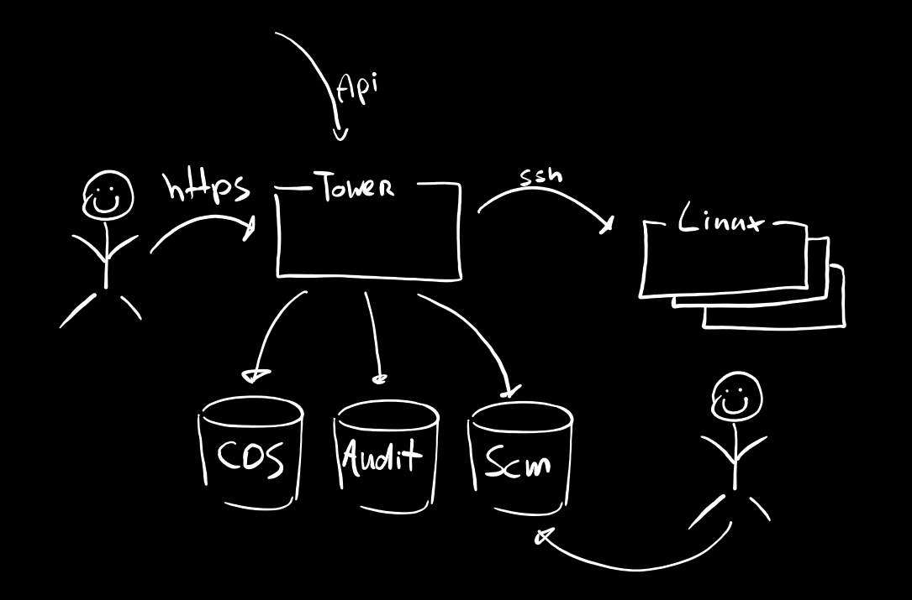
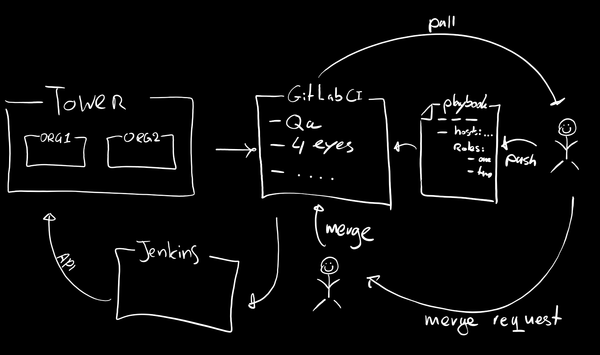
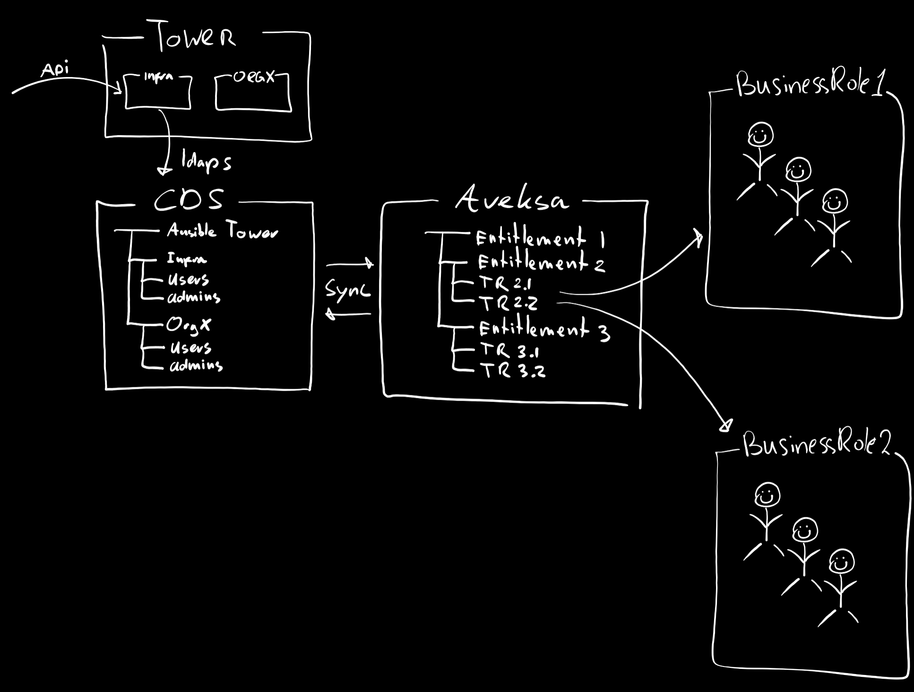
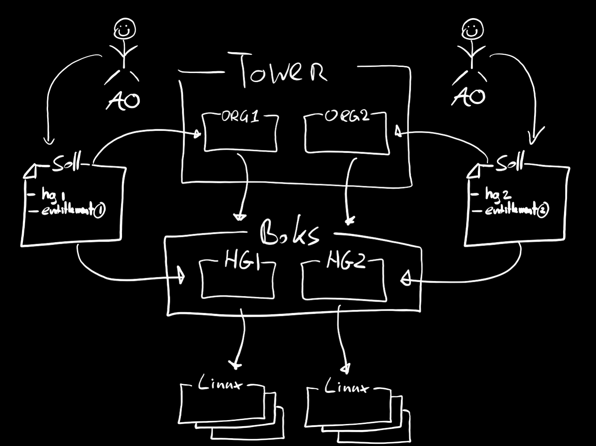

---

# Our journey

---

# Goal

- Make an impact today
- Enable engineers
- Allign with One Pipeline

---

<video width="100%" height="100%" controls>
  <source src="video/DJI00046.MP4" type="video/mp4">
Your browser does not support the video tag.
</video>

---

# Ansible Tower

- Interest from many teams
- Ansible has traction
- Usable for many
- Secure & reliable

---

# Design

---

# Use cases

## 2nd day operations
- backup/restore
- disaster recovery
- patching
- os modifications
- certificate management

---

# Current solution

---

# Green OCD

---

# Tower solution

---

# Code quality

---

# Risk & security

---

# Host access

---

# Next steps

- Create ING Galaxy (code reuse & qa)
- Ansible training (ILC, self-paced)
- Revive Ansible community
- Continue onboarding
- Formalize support model

---

# Summary

- Ready to use!
- Secure
- Scalable & highly available
- Large demand from engineer globally
- Needs allignment with One Pipeline
- Ready to use for IPC & DCR/WPR

---

# Demo

- Vincent: Ocean42 deployment
- Robert: InfraNL pipeline
- Jonathan: Managing F5 LTM
